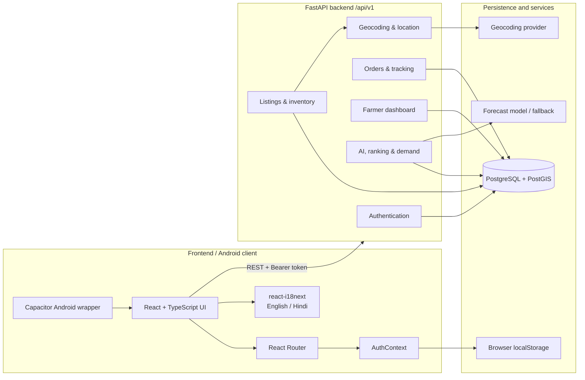
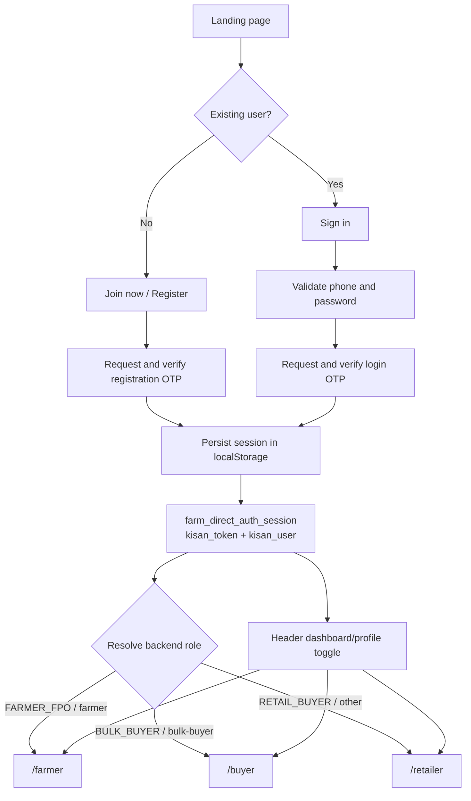
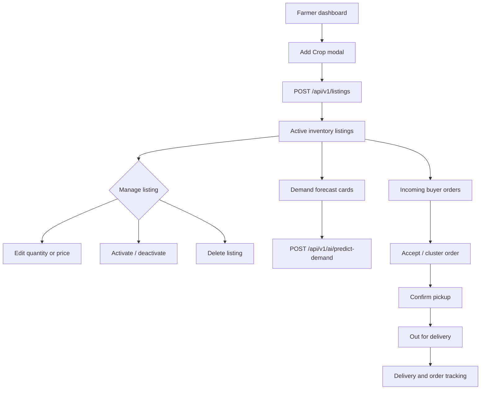
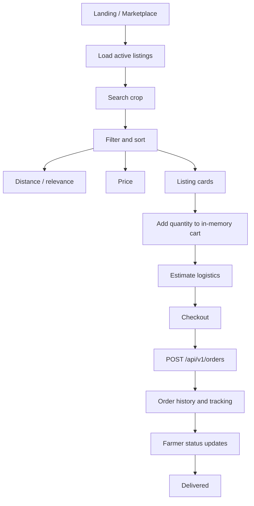

<div align="center">
  

  # Kisan Setu

  <p>Connecting farmers directly with the people they serve.</p>
  <p>A transparent digital marketplace for better agricultural trade.</p>

  
  
  
</div>

> [!IMPORTANT]
> Kisan Setu is the user-facing product brand implemented in this repository.
> The repository contains a Vite/React frontend, a Capacitor Android wrapper,
> and a FastAPI backend with PostgreSQL/PostGIS integration.

#  Project Information

* **Project Title:** Kisan Setu – खेत से द्वार तक
* **PS ID:** SIH2026-033
* **PS Title:** Multiple intermediaries reduce farmers' earnings and increase consumer prices.
* **Category:** Software
* **Theme:** Agriculture, FoodTech & Rural Development

---

#  Problem Statement

Farmers lose a significant portion of their revenue to multi-tiered intermediaries, local agents, and supply chain inefficiencies before their produce reaches end consumers or bulk buyers. This long supply chain inflates final retail prices while suppressing farm-gate earnings, reduces produce freshness due to delayed transportation, and deprives farmers of direct market access and real-time price discovery.

---

#  Proposed Solution

**Kisan Setu** is a localized, multi-role digital agricultural marketplace accessible via mobile (Android/Capacitor) and web (Vite/React). The application bridges the gap between farmers, retail consumers, and bulk buyers by providing direct trade listing workflows, automated location-based matching, transparent price discovery, and localized Hindi/English accessibility.

---

#  Impact & Benefits

### 🎯 Core Impact
* **Direct Market Access:** Currently, very few farmers can sell crops directly to the market. **Kisan Setu** eliminates middlemen by connecting farmers directly with customers and providing end-to-end logistics support.
* **Fair Pricing & Income Growth:** Farmers are traditionally forced to sell to village middlemen at lower prices, allowing agents to earn strong trading margins while reducing farmer income. Kisan Setu restores profit margins directly to the producer.

### ⭐ Key Benefits
* **Empowering Farmers:** Provides fair pricing structures, direct market visibility, and transparent price discovery without agent exploitation.
* **Fresh Produce for Customers:** Enables consumers to receive fresh produce directly from farmers, ensuring peak quality, traceability, and complete supply chain transparency.
* **Streamlined Logistics & Orders:** Integrated order management and handled logistics simplify trading transactions seamlessly for both farmers and buyers.

---

## Project Overview & Summary

Kisan Setu is a localized, mobile-first agricultural marketplace connecting **Farmers**, **Retail Consumers**, and **Bulk Buyers** in one application. Farmers can publish crop availability and manage fulfillment, while buyers can discover produce, compare listings, estimate delivery logistics, place orders, and track fulfillment.

The core mission is to **cut out middle-tier exploitation** by enabling direct price discovery, transparent seller ranking, AI-assisted demand insights, and traceable farm-to-shelf delivery workflows. The platform combines a responsive React experience with an Android application delivered through Capacitor and a REST API that manages authentication, listings, orders, location, dashboards, and AI/optimization services.

## System Architecture



The frontend API base URL can be configured with `VITE_API_BASE_URL`. If it is not provided, the client uses the configured hosted API endpoint. The backend mounts its routers below `/api/v1` and exposes a root health/welcome response at `/`.

### Backend API surface

| Area | Representative endpoints |
| --- | --- |
| Authentication | `POST /auth/register`, `POST /auth/login`, OTP request/verification, `GET /auth/me`, `PATCH /auth/me` |
| Listings | `GET /listings`, `GET /listings/search`, `POST /listings`, inventory updates, activate/deactivate, delete |
| Orders | `POST /orders`, logistics estimate, `GET /orders/{id}/track`, buyer orders, status and delivery updates |
| AI and optimization | Seller ranking, route optimization, demand prediction |
| Location | Address geocoding |
| Dashboard | `GET /dashboard/farmer-dashboard` |

## Application Flowcharts

### Authentication & persistence flow



`AuthContext` restores the current user and token during app startup. On native platforms, an authenticated user is routed directly from the root page to the relevant dashboard; on the web, the public landing page remains available.

### Farmer marketplace lifecycle



### Buyer search and purchase flow



## Key Features

### Farmer capabilities

- Create, edit, activate/deactivate, and delete crop listings.
- View active inventory, order intake, earnings, and fulfillment status.
- See crop-level demand forecast cards backed by the demand prediction service.
- Accept orders, cluster them for pickup, and advance them to dispatch.
- Edit profile and farmer account details.

### Retail Consumer capabilities

- Discover active produce listings from the marketplace.
- Search by crop and sort by relevance, distance, or price.
- View quantity, price, harvest age, seller, and logistics information.
- Add quantities to a cart, estimate delivery, check out, and review orders.
- Use a responsive mobile layout designed for quick browsing and purchase decisions.

### Bulk Buyer capabilities

- Access the marketplace through the dedicated `/buyer` protected route.
- View wholesale-oriented marketplace context and bulk purchase availability.
- Search, sort, add quantities, estimate logistics, place orders, and track fulfillment.

> [!TIP]
> Bulk Buyer currently shares the `RetailMarketplace` implementation with
> wholesale context. This keeps the core procurement path live while leaving
> room for future RFQs, supplier matching, recurring supply, and tiered
> procurement workflows.

## Tech Stack

| Layer | Technologies |
| --- | --- |
| Frontend | React 19, TypeScript, React Router, Tailwind CSS 4, Framer Motion, Lucide-style icon assets |
| Mobile wrapper | Capacitor Android, local notifications plugin |
| State and localization | React Context API, `react-i18next`, browser language detection |
| Build tools | Vite, TypeScript project build, ESLint, Gradle |
| Backend | FastAPI, Uvicorn, Pydantic Settings |
| Data layer | SQLAlchemy, PostgreSQL, PostGIS, GeoAlchemy2 |
| AI and optimization | XGBoost, scikit-learn, pandas, NumPy, joblib, deterministic seller ranking, route clustering |
| Authentication | JWT-based API sessions, OTP flows, persisted client session state |

## Repository Structure

```text
.
├── backend/
│   ├── app/
│   │   ├── api/v1/endpoints/   # auth, listings, orders, location, AI, dashboard
│   │   ├── models/             # SQLAlchemy models
│   │   ├── schemas/            # Pydantic request/response schemas
│   │   └── services/           # forecasting, ranking, routing
│   ├── requirements.txt
│   ├── init_db.py
│   └── seed_data.py
├── frontend/
│   ├── src/
│   │   ├── components/         # landing, dashboards, marketplace, profile
│   │   ├── context/            # authentication context
│   │   ├── services/           # API, auth, listing, order, AI services
│   │   ├── data/               # local/mock supporting data
│   │   ├── i18n.ts              # English and Hindi resources
│   │   └── routes.tsx
│   ├── android/                # generated Capacitor Android project
│   ├── capacitor.config.ts
│   └── package.json
└── README.md
```

## Installation & Local Setup

### Prerequisites

- Node.js and npm.
- Python 3.10+ recommended for the FastAPI backend.
- PostgreSQL with the PostGIS extension for backend persistence.
- Android Studio, Android SDK, Java 21, and a configured Android emulator/device for Capacitor builds.

### Frontend setup

```bash
git clone <repository-url>
cd kisan-setu
cd frontend
npm install
npm run dev
```

The Vite development server starts the web client. To point the frontend at a different backend, create `frontend/.env.local`:

```dotenv
VITE_API_BASE_URL=http://127.0.0.1:8000/api/v1
```

The frontend also supports the following scripts:

```bash
npm run build    # Type-check and create the Vite production bundle
npm run lint     # Run ESLint
npm run preview  # Preview the production bundle
```

### Backend setup

```bash
cd backend
python -m venv .venv
```

Activate the virtual environment, install dependencies, configure the database, initialize the schema, seed development data, and start the API:

```bash
# Windows PowerShell
.\.venv\Scripts\Activate.ps1
pip install -r requirements.txt
python init_db.py
python seed_data.py
uvicorn app.main:app --reload
```

The backend reads configuration from environment variables or `backend/.env`, including `DATABASE_URL` and project/geocoding settings. Keep credentials, Firebase keys, JWT secrets, and local environment files out of source control.

## Mobile APK Build Sequence

The Capacitor configuration uses `frontend/dist` as its web directory and packages the Android app with application ID `com.kisansetu.app`. From the repository root, run:

```bash
cd frontend
npm run build && npx cap sync android && cd android && gradlew clean && gradlew assembleDebug
```

On Windows PowerShell, use the Gradle wrapper explicitly if command resolution requires it:

```powershell
cd frontend
npm run build
npx cap sync android
cd android
.\gradlew.bat clean
.\gradlew.bat assembleDebug
```

The debug APK is generated under:

```text
frontend/android/app/build/outputs/apk/debug/app-debug.apk
```

The Android project currently targets SDK 36, supports a minimum SDK of 24, uses Gradle 8.14.3, and compiles Java sources with Java 21.

## Authentication and Local Persistence

The frontend persists session state for mobile-friendly restarts using:

- `farm_direct_auth_session` — serialized session containing token and user.
- `kisan_token` — token fallback.
- `kisan_user` — user fallback.
- `farm_direct_registered_users` — local offline account registry.
- `farm_direct_local_orders` — locally simulated offline orders.

The API client reads the persisted token and sends it as a Bearer authorization header. Treat local storage as a convenience for session continuity, not as a substitute for server-side token expiry, secure credential storage, or authorization enforcement.
---

# Future Scope

The future roadmap for **Kisan Setu** focuses on expanding AI automation, quality verification, and supply chain logistics to further empower agricultural communities:

* **🗣️ Voice-Assisted Conversational AI:** Integrate multilingual speech recognition (Speech-to-Text) supporting regional Indian languages and dialects, allowing farmers to list crops, update prices, or check Mandi rates purely using voice commands.
* **🌾 AI-Powered Quality & Crop Disease Inspection:** Implement on-device computer vision models (TensorFlow Lite) to analyze crop quality, estimate freshness, and detect plant diseases directly from mobile camera uploads.
* **🚚 Hyperlocal Cold-Chain & Logistics Aggregation:** Partner with third-party logistics APIs (Porter, Shadowfax) and regional cold-storage aggregators to optimize transit routes and preserve perishable produce quality.
